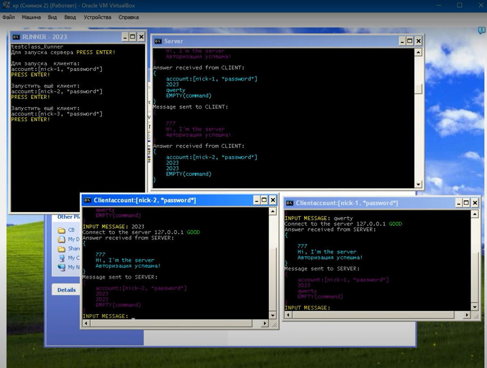

# SWAR-2023
 Крестовый сервак для Морского Боя и не только для него(!)
    
____
## Что тут.
1. Работа связки сервера-клиента в обменене сообщений между собой.
2. Внутри два варианта: строковый и пакетный.
3. [Реализован на базе SFML.](https://www.sfml-dev.org/download/sfml/2.5.1/)
4. Cкомпилировано компилятором [MSYS2.](https://www.msys2.org/)
5. В IDE Code::Blocks
	
____
## Особенности.
1. Это первая - стартовая версия.
2. Тестился пока только локально на Windows'e
3. ...
    
____
## Как заюзать данный ТЕСТ.
1. В папке bin лежит main.exe 32-бит.
2. При его запуске БЕЗ ПАРАМЕТРОВ запускается окно с Runner'ом.
3. В окне Runner при клике на Enter запускается окно Server'a.
4. Далее запусаются Клиенты, столько, сколько нужно.
5. Каждый клиент при нажатии на Enter посылает сообщения серверу.
6. Сервер отвечает.
7. После ТРЁХ сообщений клиент закрывается.
8. В Runner можно продолжить запуск клиентов.
    
____
## Что не хватает.
1. Собсно, самого Морского Боя.(лежит отдельно в папке SWAR)
2. Вместо него чуть позже я добавлю Заглушку.
3. ...    
...
    
____
    

